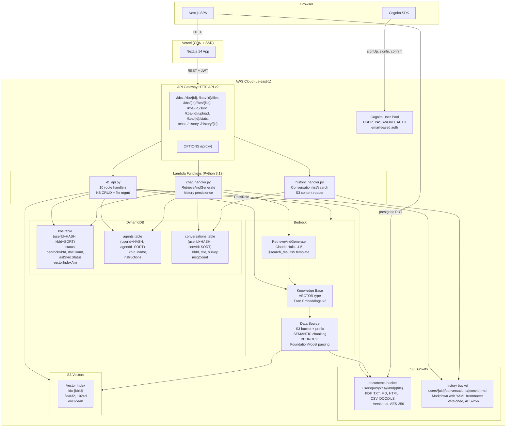

# Sanket Custom Chatbot — Technical Architecture

## Overview

Serverless RAG (Retrieval-Augmented Generation) application built on AWS Bedrock Knowledge Bases. Users create knowledge bases, upload documents, sync them to a vector store, and ask natural-language questions against their data using Claude Haiku 4.5.

**Live URL**: https://sanket-custom-chatbot.vercel.app

---

## System Architecture



---

## Component Overview

| Layer | Technology | Purpose |
|-------|-----------|---------|
| Frontend | Next.js 14, React 18, Tailwind CSS, lucide-react | SPA with auth, KB management, chat UI, history |
| Auth | Cognito User Pool | Email-based auth, JWT tokens, session refresh |
| API | API Gateway HTTP API v2 | REST API, 15 routes, CORS |
| Compute | Lambda Python 3.13 | 3 functions: KB CRUD, RAG chat, history |
| Storage | DynamoDB | Metadata: KBs, agents, conversations |
| Storage | S3 | Documents, conversation history |
| Vector | S3 Vectors | Embedding storage (1024d float32, euclidean) |
| AI | Bedrock KB + Claude Haiku 4.5 | Document parsing, chunking, RAG |
| Infra | Terraform Cloud | All AWS resources as code |

---

## Core Flows

### Create KB
```
Frontend → POST /kbs → kb_api →
  1. Rate-limit check (max 10 KBs)
  2. S3 Vectors: CreateIndex (1024d, euclidean)
  3. Bedrock: CreateKnowledgeBase (Titan Embeddings v2, S3_VECTORS)
  4. Bedrock: CreateDataSource (S3 prefix, SEMANTIC chunking, BEDROCK_FM parsing)
  5. DynamoDB: PutItem (status: CREATING)
```

### Upload & Sync
```
Frontend → POST /kbs/{id}/upload → kb_api:
  - Returns presigned S3 URLs (single or batch)
Frontend → PUT presigned URL → S3 (direct, no Lambda in path)

Frontend → POST /kbs/{id}/sync → kb_api:
  1. Starts Bedrock ingestion job
  2. DynamoDB: lastSyncStatus = IN_PROGRESS
  3. Frontend polls GET /kbs/{id}/sync until COMPLETE/FAILED
```

### Chat
```
Frontend → POST /chat → chat_handler:
  1. Look up KB from DynamoDB (get bedrockKbId)
  2. Look up agent instructions if agentId provided
  3. Bedrock: RetrieveAndGenerate
     - knowledgeBaseId, modelArn (Claude Haiku 4.5)
     - $search_results$ template with optional agent instructions
  4. Parse citations, deduplicate by chunkId
  5. Append to S3 history markdown file
  6. Upsert/update DynamoDB conversation record
```

### Auth
```
Frontend:
  - Cognito SDK direct from browser (InitiateAuth USER_PASSWORD_AUTH)
  - Tokens stored in localStorage
  - API calls: Authorization: Bearer <idToken>

Backend:
  - Extract JWT from Authorization header
  - Base64-decode payload (no crypto verify — trust HTTPS)
  - Extract cognito:username or sub as userId
  - All operations scoped to userId
```

---

## Key Technical Decisions

| Decision | Rationale |
|----------|-----------|
| Claude Haiku 4.5 via inference profile | Newer Claude models only support INFERENCE_PROFILE type; cross-region us. profile handles failover |
| `$search_results$` template placeholder | Required by KNOWLEDGE_BASE RetrieveAndGenerate; `{context}`/`{input_text}` cause ValidationException |
| S3 Vectors with non-filterable metadata | Filterable metadata capped at 2048 bytes; `AMAZON_BEDROCK_TEXT` must be non-filterable at index creation |
| indexedCount from Bedrock ingestion stats | Dynamic computation (scanned - failed) avoids stale DynamoDB caches |
| JWT decode-only (no verification) | HTTPS provides transport security; reduces overhead; Cognito tokens are signed but verification adds latency with no meaningful gain in API Gateway→Lambda context |
| 3 US region foundation model ARNs in IAM | Cross-region `us.` inference profile routes to us-east-1, us-east-2, or us-west-2 |
| Parsing + chunking immutable after creation | Bedrock API limitation — must delete and recreate data source to change either configuration |
| react-markdown + remark-gfm + mermaid | Richer output rendering than plain text; supports tables, code blocks, diagrams |

---

## File Reference

| File | Path |
|------|------|
| Infrastructure (Terraform) | `tech-docs/01-infrastructure.md` |
| Data Model | `tech-docs/02-data-model.md` |
| Backend (Lambdas) | `tech-docs/03-backend.md` |
| Frontend Pages | `tech-docs/04-frontend-pages.md` |
| Frontend Components | `tech-docs/05-frontend-components.md` |
| Frontend Libraries | `tech-docs/06-frontend-lib.md` |
| Build & Deploy | `tech-docs/07-build-deploy.md` |
| Architecture Diagram | `tech-docs/architecture.drawio` |
